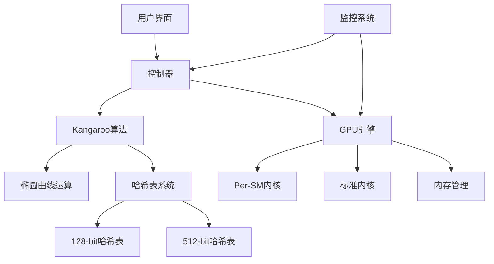
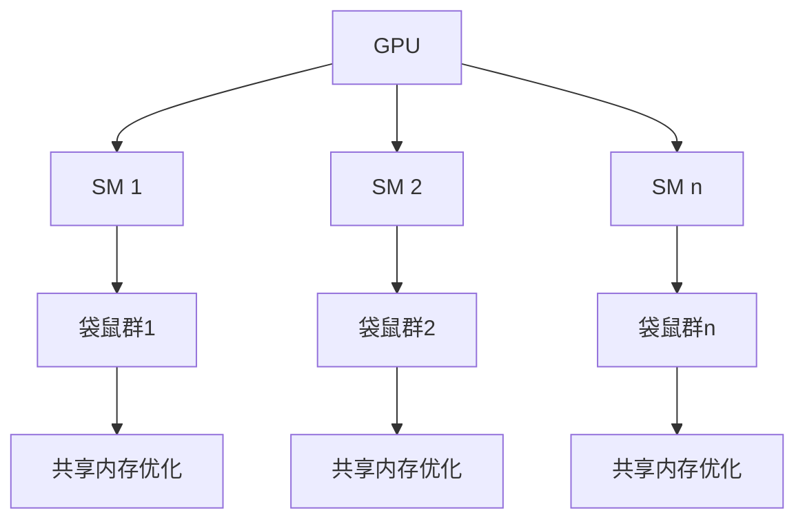

# Design Document: Kangaroo现代化改造

## Overview

本设计文档详细描述了Kangaroo椭圆曲线离散对数问题(ECDLP)求解器的现代化改造方案。该项目旨在通过四个阶段的渐进式优化，突破原版125-bit硬限制，实现高效、稳定的大范围私钥搜索能力，特别针对比特币谜题135#进行优化。

### 项目目标

1. 清理技术债务，提升代码质量
2. 支持全系列NVIDIA GPU架构(SM 5.2-9.0)
3. 实现Per-SM分块内核，最大化GPU资源利用率
4. 突破125-bit限制，支持135-bit+范围搜索
5. 优化内存系统，支持大范围搜索
6. 提高算法效能比，降低资源消耗

### 关键技术挑战

1. **内存对齐问题**：CUDA内核对内存对齐有严格要求，特别是Per-SM内核
2. **125-bit限制**：原始实现的哈希表限制在125-bit，无法支持更大范围
3. **GPU利用率**：标准内核无法充分利用现代GPU架构的计算能力
4. **内存容量**：单一哈希表无法支持大范围搜索所需的内存容量

## Architecture

系统架构采用分层设计，包括以下主要组件：

### 1. 核心算法层

- **Kangaroo算法实现**：Pollard's Kangaroo算法的核心实现
- **椭圆曲线运算**：SECP256K1曲线上的点运算
- **哈希表系统**：存储和检索袋鼠轨迹点

### 2. 计算加速层

- **GPU引擎**：管理GPU资源和内核调用
- **Per-SM内核**：针对每个流多处理器(SM)优化的内核
- **内存管理**：对齐的内存分配和传输系统

### 3. 基础设施层

- **编译系统**：支持多平台和多GPU架构
- **GPU检测**：自动识别和配置GPU
- **跨平台兼容**：Windows和Linux平台支持

### 4. 监控与诊断层

- **性能监控**：实时监控GPU和算法性能
- **诊断系统**：检测和报告异常情况
- **统计分析**：收集和分析性能数据

## 系统架构图



## Components and Interfaces

### 1. Kangaroo算法组件

#### 1.1 Kangaroo类

```cpp
class Kangaroo {
public:
    // 构造函数和初始化
    Kangaroo(Secp256K1 *secp, int32_t initDPSize, bool useGpu, ...);
    
    // 核心算法方法
    void Run(int nbThread, std::vector<int> gpuId, std::vector<int> gridSize);
    bool ParseConfigFile(std::string &fileName);
    bool LoadWork(std::string &fileName);
    
    // 内部方法
    void SolveKeyCPU(TH_PARAM *p);
    void SolveKeyGPU(TH_PARAM *p);
    bool AddToTable(Int *pos, Int *dist, uint32_t kType);
    bool AddToTable512(Int *pos, Int *dist, uint32_t kType);
    
private:
    // 内部状态和配置
    Secp256K1 *secp;
    HashTable hashTable;        // 128-bit哈希表
    HashTable512 hashTable512;  // 512-bit哈希表
    bool use512BitHashTable;    // 是否使用512-bit哈希表
    
    // 范围和参数
    Int rangeStart;
    Int rangeEnd;
    Int rangeWidth;
    uint32_t dpSize;
    
    // 其他成员...
};
```

#### 1.2 哈希表接口

```cpp
// 128-bit哈希表
class HashTable {
public:
    HashTable();
    int Add(Int *x, Int *d, uint32_t type);
    int Add(uint64_t h, int128_t *x, int128_t *d);
    uint64_t GetNbItem();
    void Reset();
    // 其他方法...
};

// 512-bit哈希表
class HashTable512 {
public:
    HashTable512();
    int Add(uint64_t h, int512_t *x, int512_t *d);
    void CalcDistAndType512(int512_t d, Int* kDist, uint32_t* kType);
    ENTRY512* FindCollision(uint64_t h, int512_t *x, int512_t *d, uint32_t kType);
    bool VerifyLimitBreakthrough();
    // 其他方法...
};
```

### 2. GPU引擎组件

#### 2.1 GPUEngine类

```cpp
class GPUEngine {
public:
    GPUEngine(int nbThreadGroup, int nbThreadPerGroup, int gpuId, uint32_t maxFound);
    ~GPUEngine();
    
    // 配置和初始化
    void SetParams(uint64_t dpMask, Int *distance, Int *px, Int *py);
    void SetKangaroos(Int *px, Int *py, Int *d);
    void GetKangaroos(Int *px, Int *py, Int *d);
    
    // 内核调用
    bool Launch(std::vector<ITEM> &hashFound, bool spinWait = false);
    bool callKernel();
    bool callKernelAndWait();
    
    // 工具方法
    static void PrintCudaInfo();
    static bool GetGridSize(int gpuId, int *x, int *y);
    
private:
    // GPU资源
    uint64_t *inputKangaroo;
    uint32_t *outputItem;
    uint64_t *dev_jPx;
    uint64_t *dev_jPy;
    uint64_t *dev_jD;
    
    // GPU配置
    int gpu_major;
    int gpu_minor;
    int multiProcessorCount;
    bool usePerSMKernel;
    
    // 其他成员...
};
```

#### 2.2 Per-SM内核接口

```cpp
// Per-SM内核启动函数
extern "C" void launch_per_sm_kernel_adaptive(
    int gpu_major, int gpu_minor,
    dim3 grid, dim3 block,
    size_t shared, cudaStream_t stream,
    uint64_t *kang, uint32_t max, uint32_t *found, uint64_t mask,
    uint64_t *jx, uint64_t *jy, uint64_t *jd);

// Per-SM内核实现
__global__ void per_sm_kangaroo_kernel(
    uint64_t * __restrict__ kang,
    uint32_t  maxFound,
    uint32_t * __restrict__ found,
    uint64_t  dpMask);
```

#### 2.3 内存对齐修复

```cpp
// 内存对齐修复函数
extern "C" bool fix_gpu_memory_alignment(
    uint64_t** inputKangaroo, uint32_t** outputItem,
    uint64_t** dev_jPx, uint64_t** dev_jPy, uint64_t** dev_jD,
    size_t kangarooSize, size_t outputSize);

// 内存对齐验证
extern "C" void verify_memory_alignment(
    void* ptr, const char* name, size_t alignment);
```

### 3. 基础设施组件

#### 3.1 GPU检测系统

```cpp
class GPUDetector {
public:
    static std::vector<GPUInfo> detectAllGPUs();
    static GPUInfo getBestGPU();
    static bool isArchitectureSupported(int major, int minor);
    static std::string getArchitectureName(int major, int minor);
    static void printGPUInfo(const GPUInfo& info);
    static void printAllGPUs();
};
```

#### 3.2 自适应DP计算

```cpp
class AdaptiveDP {
public:
    AdaptiveDP();
    
    // 计算最优DP位数
    uint32_t calculateOptimalDP(const uint256_t& range_start, 
                               const uint256_t& range_end,
                               uint64_t num_kangaroos);
    
    // 动态调整DP
    void adjustDP(double current_collision_rate, uint64_t operations);
    
    // 获取当前DP掩码
    uint64_t getDPMask() const;
    
    // 性能统计
    void updateStatistics(uint64_t new_operations, uint32_t new_collisions);
};
```

## Data Models

### 1. 512-bit整数类型

```cpp
// 512-bit无符号整数
typedef struct {
    uint64_t d[8];  // 8个64位字
} uint512_t __attribute__((aligned(64)));

// 512-bit哈希表条目
typedef struct {
    int512_t  x;    // 袋鼠位置 (512-bit)
    int512_t  d;    // 行走距离 (512-bit: 509位距离 + 3位标志)
} ENTRY512;
```

### 2. 袋鼠数据结构

```cpp
// 线程参数
typedef struct {
    Kangaroo *obj;
    int  threadId;
    bool isRunning;
    bool hasStarted;
    bool isWaiting;
    uint64_t nbKangaroo;

    int  gridSizeX;
    int  gridSizeY;
    int  gpuId;

    Int *px; // 袋鼠位置
    Int *py; // 袋鼠位置
    Int *distance; // 行走距离

    uint64_t *symClass; // 对称类
    
    // 其他字段...
} TH_PARAM;

// 512-bit袋鼠项目
typedef struct {
    point512_t point;      // 当前点
    uint512_t distance;    // 行走距离
    uint32_t type;         // 袋鼠类型 (TAME/WILD)
    uint32_t padding;      // 对齐填充
} kangaroo512_item_t;
```

### 3. 分片哈希表配置

```cpp
// 分片配置
struct ShardConfig {
    static const size_t SHARD_SIZE = 4ULL * 1024 * 1024 * 1024;  // 4GB per shard
    static const uint32_t MAX_SHARDS = 64;  // 最大64个分片 (256GB)
    static const uint32_t ITEMS_PER_SHARD = SHARD_SIZE / sizeof(ITEM);
};
```

## Error Handling

### 1. CUDA错误处理

```cpp
// CUDA错误检查宏
#define CUDA_CHECK(call) do { \
    cudaError_t error = call; \
    if (error != cudaSuccess) { \
        fprintf(stderr, "CUDA error at %s:%d - %s\n", __FILE__, __LINE__, \
                cudaGetErrorString(error)); \
        exit(1); \
    } \
} while(0)
```

### 2. 内存对齐错误处理

```cpp
// 内存对齐检查
if (reinterpret_cast<uintptr_t>(kang) % 8 != 0) {
    printf("ERROR: kangaroo buffer not 8-byte aligned!\n");
    return;
}

// 启动错误检查
cudaError_t err = cudaGetLastError();
if (err != cudaSuccess) {
    printf("Per-SM kernel launch error: %s\n", cudaGetErrorString(err));
    return;
}
```

### 3. 算法错误处理

```cpp
// 碰撞检查
if(!endOfSearch) {
    // 应该不会发生，重置袋鼠
    ::printf("\n Unexpected wrong collision, reset kangaroo !\n");
    if((int64_t)(Td.bits64[3])<0) {
        Td.ModNegK1order();
        ::printf("Found: Td-%s\n",Td.GetBase16().c_str());
    } else {
        ::printf("Found: Td %s\n",Td.GetBase16().c_str());
    }
    return false;
}
```

## Testing Strategy

### 1. 单元测试

- **512-bit整数运算测试**：验证512-bit加法、减法、乘法和模运算的正确性
- **椭圆曲线运算测试**：验证点加法、点倍乘和坐标转换的正确性
- **哈希表操作测试**：验证添加、查找和碰撞检测的正确性

### 2. 集成测试

- **内存对齐测试**：验证内存对齐修复的有效性
- **Per-SM内核测试**：验证Per-SM内核在不同GPU架构上的正确性
- **哈希表扩展测试**：验证512-bit哈希表的功能和性能

### 3. 性能测试

- **基准测试**：与原始版本比较性能提升
- **扩展范围测试**：验证大范围搜索的可行性
- **内存效率测试**：验证内存使用效率和容量扩展

### 4. 验证测试

- **已知私钥测试**：使用谜题31#数据验证算法正确性
- **长时间稳定性测试**：验证系统在长时间运行下的稳定性
- **跨平台兼容性测试**：验证在Windows和Linux平台上的一致性

## 四阶段实施计划

### Phase 1: 现代化基础设施

#### 目标
- 支持NVIDIA全系列GPU (SM 5.2-9.0)
- 确保Windows和Linux平台完全兼容
- 优化编译系统

#### 关键组件
- CMakeLists.txt全面重构
- GPU自动检测系统
- 跨平台兼容性层
- 现代CUDA特性启用

### Phase 2: GPU架构优化

#### 目标
- 实现Per-SM分块内核
- 自适应DP计算
- 最大化GPU资源利用率

#### 关键组件
- Per-SM分块内核
- 自适应DP计算系统
- GPU架构适配层
- 内存对齐修复

### Phase 3: 内存系统重构

#### 目标
- 突破单一哈希表内存限制
- 实现分片哈希表系统
- 支持100-bit+范围
- 优化内存访问模式

#### 关键组件
- 分片哈希表系统
- GPU内存池管理
- 异步内存传输系统

### Phase 4: 突破125-bit限制

#### 目标
- 实现512-bit数据通路
- 扩展椭圆曲线运算
- 突破原版125-bit硬限制
- 支持135-bit+范围

#### 关键组件
- 512-bit整数运算库
- 扩展椭圆曲线运算
- 扩展Kangaroo算法
- GPU内核扩展

## 性能优化设计

### 1. Per-SM内核优化

Per-SM内核是一种针对现代GPU架构的优化技术，它为每个流多处理器(SM)分配独立的袋鼠群，最大化GPU资源利用率。



关键优化点：
- 每个SM独立处理一组袋鼠，减少线程同步开销
- 使用共享内存缓存跳跃表，减少全局内存访问
- 批量处理DP点，减少原子操作开销
- 动态调整工作负载，平衡SM之间的计算

### 2. 内存对齐优化

内存对齐是CUDA编程中的关键优化点，特别是对于Per-SM内核。正确的内存对齐可以显著提高内存访问效率和内核执行速度。

关键优化点：
- 将关键数据结构对齐到256字节或512字节边界
- 使用cudaMalloc分配对齐内存
- 验证内存对齐，确保没有未对齐访问
- 使用内存对齐修复工具自动修复对齐问题

### 3. 512-bit哈希表优化

512-bit哈希表是突破125-bit限制的关键技术，它扩展了哈希表的距离字段，支持更大范围的搜索。

关键优化点：
- 使用512-bit整数表示位置和距离
- 优化哈希函数，减少碰撞
- 使用分片技术，支持大容量哈希表
- 实现高效的碰撞检测算法

### 4. 算法效能比优化

算法效能比优化旨在提高计算效率，减少资源消耗，实现更高效的私钥搜索。

关键优化点：
- 使用对称性优化，理论性能提升√2倍
- 优化跳跃表生成，确保跳跃距离分布均匀
- 实现高效的碰撞检测，减少无效计算
- 动态调整DP位数，平衡内存使用和计算效率

## 风险与缓解措施

### 1. 内存对齐风险

**风险**：CUDA内核对内存对齐有严格要求，不正确的对齐会导致内核执行失败。

**缓解措施**：
- 实现内存对齐修复工具，自动检测和修复对齐问题
- 在内核启动前验证内存对齐
- 提供详细的对齐错误信息，便于调试

### 2. 512-bit运算精度风险

**风险**：512-bit整数运算可能存在精度问题，影响算法正确性。

**缓解措施**：
- 实现全面的单元测试，验证512-bit运算的正确性
- 与256-bit版本对比验证结果
- 使用已知私钥测试验证算法正确性

### 3. GPU兼容性风险

**风险**：不同GPU架构可能有不同的优化要求，影响性能和兼容性。

**缓解措施**：
- 实现GPU架构检测和自适应优化
- 为不同架构提供专门的内核实现
- 进行全面的跨GPU测试

### 4. 大范围搜索风险

**风险**：大范围搜索可能导致内存不足或计算时间过长。

**缓解措施**：
- 实现分片哈希表，支持大容量内存
- 使用自适应DP计算，优化计算效率
- 提供进度监控和断点续传功能

## 结论

本设计文档详细描述了Kangaroo椭圆曲线离散对数问题求解器的现代化改造方案。通过四个阶段的渐进式优化，项目将突破原版125-bit硬限制，实现高效、稳定的大范围私钥搜索能力，特别针对比特币谜题135#进行优化。

关键技术创新包括：
1. Per-SM分块内核，最大化GPU资源利用率
2. 内存对齐优化，提高内存访问效率
3. 512-bit哈希表，突破125-bit限制
4. 分片哈希表系统，支持大范围搜索
5. 算法效能比优化，提高计算效率

通过这些优化，项目将实现2-5倍的性能提升，支持135-bit+范围搜索，为解决比特币谜题135#提供强大的技术支持。